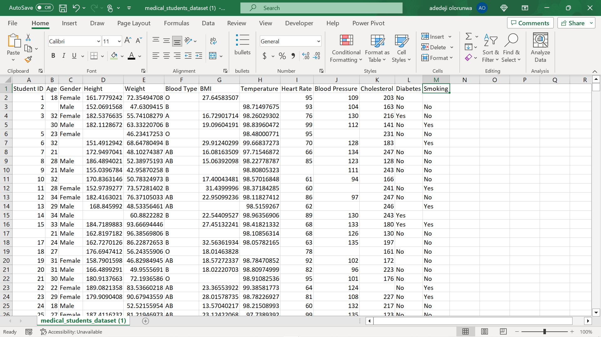
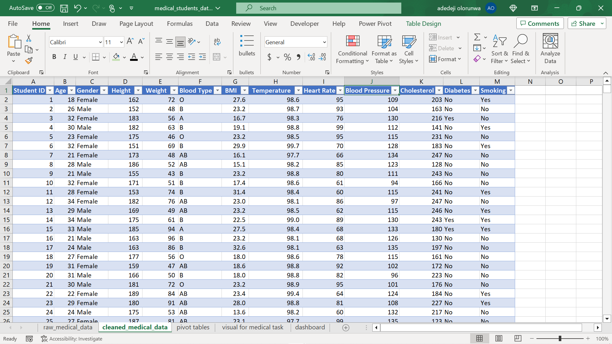
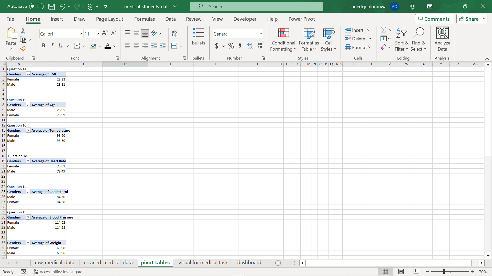
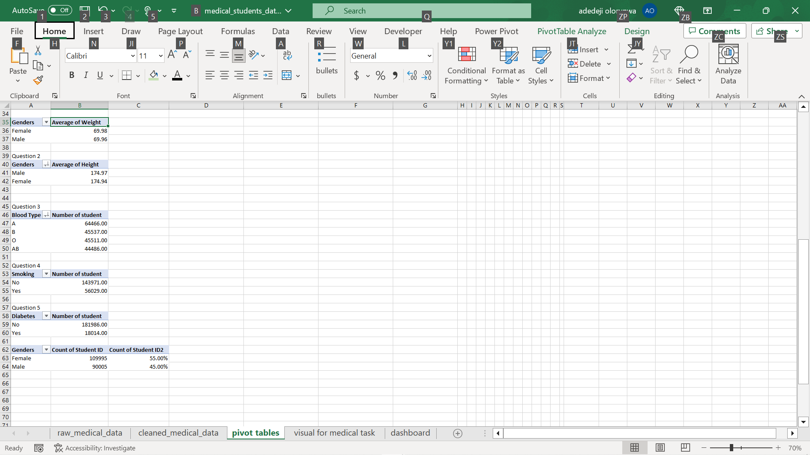
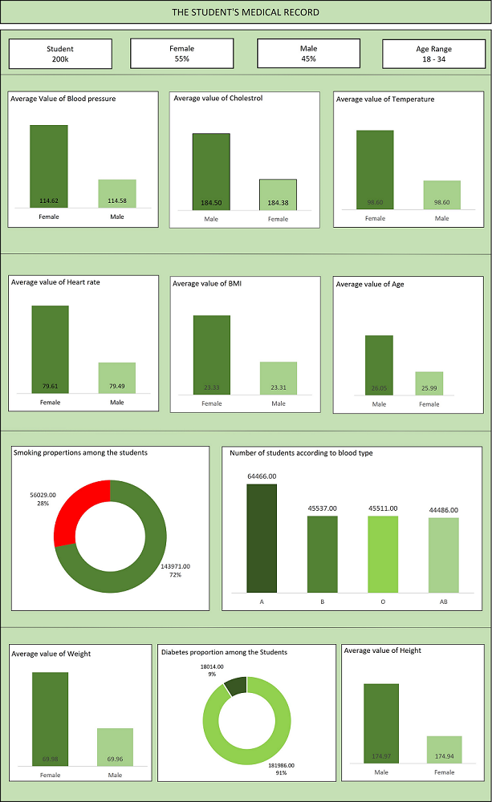

# Analysis-of-student-medical-report

-------
## Introduction

After learning the usage of pivot table in excel, here is an analysis done on Student medical record from which pivot table is used to perform statistical analysis and arrive at some informative decision.

--------

### Problem Statement

The following tasks are being determined using the datasets *Student medical records* provided by the instructor after the tutorial. 
  1. The average values for the following for Male and Female:
     - Age,
     - BMI,
     - Temperature,
     - Heart Rate,
     - Blood Pressure,
     - Cholesterol.
  2. The Average height and weight of both Genders in (2 decimal places)
  3. Number of students across the different Blood Groups.
  4. Number of students who smoke and those who don’t.
  5. Numbers of students who have diabetes and those who doesn’t.
And visualization is produced using the information derived from the pivot table application.
---------

### Skills Demonstrated.
  - Data collection,
  - Data cleaning,
  - Pivot Tables of Cleaned Data,
  - Visualisation of insight

------

### Data Sourcing

The dataset (student medical record) used for this analysis was an uncleaned data provided by the instructor.
It consists of 2000001 rows and 13 columns with many missing data.

Let’s get to work👊

-------

### Data Cleaning
To start with data cleaning, I started by filling the missing value for the letter column by doing the following procedures.
  - Selecting the column to format,
  - Using the "Find & select" option, I used the "Go to special" icon to highlight all the blank spaces and fill it all automatically with “Yes”(Optional) using crtl + Enter key.
    
For the number column, I calculated(Instructor's order) the average of the range for each column using the Excel function =average(arguments), the value obtained here is used to saturate the blanks using the same procedures as explained above.
For the first column which consist of student ID, I formatted the column by using the "fill icon", then the "series", to "column" and inputing the step value = 1, and stop value = 200001.
This cleaned the column and remove blanks and duplicates value with 1 – 200000 in this order

------

### Data analysis using PIVOT TABLEs

Data analysis

For the first task where the average of BMI, Temperature, Age, Blood Pressure, Heart Rate, Cholesterol needed to be calculated,
I do that in the following steps.
  - Click on the table which the data resides, navigate to insert icon and create a pivot table in another worksheet,
  - Selecting the Gender field to the row and each other categories into the value section gives me my desire analysis,
  - Selecting the function to be average gives the average of all the value in the pivot table.
  - I repeat the same procedure for other categories.

    

For the next tasks I executes the same procedures as explained above and substituting height, weight, blood group, student smoking and diabetic to get my desired result as regard to the questions.

### Visualiasation of insights

